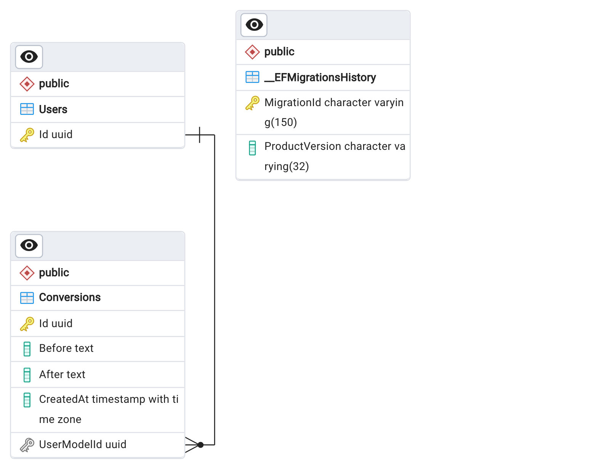

<a name="readme-top"></a>

[![Contributors][contributors-shield]][contributors-url]
[![Forks][forks-shield]][forks-url]
[![Stargazers][stars-shield]][stars-url]
[![Issues][issues-shield]][issues-url]
[![MIT License][license-shield]][license-url]
[![LinkedIn][linkedin-shield]][linkedin-url]

<!-- PROJECT LOGO -->
<br />
<div align="center">
  <a href="https://github.com/MateuszKrolik/Csharp_ASPNET_Core_MVC_JQuery_Text_Converter">
    
  </a>

<h3 align="center">Csharp_ASPNET_Core_MVC_JQuery_Text_Converter</h3>

  <p align="center">
    <br />
    <a href="https://github.com/MateuszKrolik/Csharp_ASPNET_Core_MVC_JQuery_Text_Converter"><strong>Explore the docs »</strong></a>
    <br />
    <br />
    <a href="https://github.com/MateuszKrolik/Csharp_ASPNET_Core_MVC_JQuery_Text_Converter">View Demo</a>
    ·
    <a href="https://github.com/MateuszKrolik/Csharp_ASPNET_Core_MVC_JQuery_Text_Converter/issues/new?assignees=&labels=bug&projects=&template=bug-report.md" >Report Bug</a>
    ·
    <a href="https://github.com/MateuszKrolik/Csharp_ASPNET_Core_MVC_JQuery_Text_Converter/issues/new?assignees=&labels=enhancement&projects=&template=feature-request.md">Request Feature</a>
  </p>
</div>

<!-- TABLE OF CONTENTS -->
<details>
  <summary>Table of Contents</summary>
  <ol>
    <li>
      <a href="#about-the-project">About The Project</a>
      <ul>
        <li><a href="#built-with">Built With</a></li>
      </ul>
    </li>
    <li>
      <a href="#getting-started">Getting Started</a>
      <ul>
        <li><a href="#prerequisites">Prerequisites</a></li>
        <li><a href="#installation">Installation</a></li>
      </ul>
    </li>
    <li><a href="#roadmap--usage">Roadmap</a></li>
    <li><a href="#contributing">Contributing</a></li>
    <li><a href="#license">License</a></li>
    <li><a href="#contact">Contact</a></li>
  </ol>
</details>

<!-- ABOUT THE PROJECT -->

To test out the WebSite yourself, you can use the following 😉
link: [Project Link](https://mkrolik-text-converter.ashycoast-2fd8c4d9.germanywestcentral.azurecontainerapps.io/)

### 1. PostgreSQL & Entity FrameWork DataBase ERD Diagram



### 2. Video Walkthrough of Features:

https://github.com/user-attachments/assets/ab2385ab-ffad-45c3-8a95-087cc7840298

<p align="right">(<a href="#readme-top">back to top</a>)</p>

### Built With

<!-- Programming Languages -->

- [![C#][Csharp.com]][Csharp-url]
- [![JavaScript][JavaScript.com]][JavaScript-url]
<!-- Web Technologies -->
- [![ASP.NET][ASPNET.com]][ASPNET-url]
- [![Entity Framework][EntityFramework.com]][EntityFramework-url]
- [![jQuery][jQuery.com]][jQuery-url]
- [![Bootstrap][Bootstrap.com]][Bootstrap-url]
<!-- DataBases -->
- [![PostgreSQL][PostgreSQL.com]][PostgreSQL-url]
- [![Cockroach Labs][CockroachLabs.com]][CockroachLabs-url]
<!-- Testing Frameworks -->
- [![xUnit][xUnit.com]][xUnit-url]
<!-- Cloud Deployment Services -->
- [![Azure][Azure.com]][Azure-url]
- [![Azure Container Apps][AzureContainerApps.com]][AzureContainerApps-url]
- [![Azure Resource Manager][AzureResourceManager.com]][AzureResourceManager-url]
<!-- DevTools -->
- [![Bash][Bash.com]][Bash-url]
- [![Docker][Docker.com]][Docker-url]
- [![Linux][Linux.com]][Linux-url]
- [![.ENV][Dotenv.com]][Dotenv-url]
<!-- DataFormats -->
- [![JSON][JSON.com]][JSON-url]
- [![YAML][YAML.com]][YAML-url]

<p align="right">(<a href="#readme-top">back to top</a>)</p>

<!-- GETTING STARTED -->

## Getting Started

When setting up the project locally, I suggest adding your own custom environment variables via ".env" and "parameters.json" files,
also run chmod +x to make BASH Scripts Executable.

### Prerequisites

You should have .NET SDK, DockerDesktop and Azure CLI (Requires Python) installed.

I also suggest setting up Azure Data Studio (for ARM/64 users) for smooth DataBase Management.

### Installation

1. Clone the repo
   ```sh
   git clone https://github.com/MateuszKrolik/Csharp_ASPNET_Core_MVC_JQuery_Text_Converter.git
   ```

<p align="right">(<a href="#readme-top">back to top</a>)</p>

<!-- ROADMAP & USAGE -->

## Roadmap & Usage

- [x] FullStack MVC WebSite via:
  - [x] C#
  - [x] JavaScript
  - [x] ASP.NET Core
  - [x] Entity Framework
  - [x] JQuery
  - [x] BootStrap
  - [x] PostgreSQL
- [x] Security from SQL-Injection with Entity Framework
- [x] 1:N Relationship between Users & Conversions via Entity Framework & Identity
- [x] Loose-Coupling and Abstraction of Services with Interfaces in Repository OOP Design Pattern
- [x] Constructor Dependency Injection for:
  - [x] Leet Speak API
- [x] Error Handling via:
  - [x] Global Exception Handler
  - [x] 404 Page
- [x] Dynamic Error Message Display when Reaching API Rate Limit
- [x] PostgreSQL DataBase Management with Azure Data Studio/PgAdmin
- [x] CockroachDB Service for Serverless DB Hosting on GCP
- [x] Optimized Docker Image of the REST API with .NET SDK & BASH
- [x] DockerHub storage for Docker Image
- [x] Infrastructure-as-Code (IaC) with Azure Resource Manager (ARM) using JSON Deployment Template
- [x] Secure loading of JSON Parameter EnvironmentVariable Secrets during Azure CLI Deployment with BASH Script
- [x] Deployment of the C# .NET REST API to Azure Container Apps Service from DockerHub Container Registry via IaC

See the [open documentation](https://github.com/MateuszKrolik/Csharp_ASPNET_Core_MVC_JQuery_Text_Converter/issues) for a full
list of proposed features (and
known issues).

<p align="right">(<a href="#readme-top">back to top</a>)</p>

<!-- CONTRIBUTING -->

## Contributing

Contributions are what make the open source community such an amazing place to learn, inspire, and create. Any
contributions you make are **greatly appreciated**.

If you have a suggestion that would make this better, please fork the repo and create a pull request. You can also
simply open an issue with the tag "enhancement".
Don't forget to give the project a star! Thanks again!

1. Fork the Project
2. Create your Feature Branch (`git checkout -b feature/AmazingFeature`)
3. Commit your Changes (`git commit -m 'Add some AmazingFeature'`)
4. Push to the Branch (`git push origin feature/AmazingFeature`)
5. Open a Pull Request

<p align="right">(<a href="#readme-top">back to top</a>)</p>

<!-- LICENSE -->

## License

Distributed under the MIT License. See `LICENSE` for more information.

<p align="right">(<a href="#readme-top">back to top</a>)</p>

<!-- CONTACT -->

## Contact

Mateusz Królik - mateuszkrolik87@gmail.com

Project
Link: [https://mkrolik-text-converter.ashycoast-2fd8c4d9.germanywestcentral.azurecontainerapps.io/](https://mkrolik-text-converter.ashycoast-2fd8c4d9.germanywestcentral.azurecontainerapps.io/)

Project Repository
Link: [https://github.com/MateuszKrolik/Csharp_ASPNET_Core_MVC_JQuery_Text_Converter](https://github.com/MateuszKrolik/Csharp_ASPNET_Core_MVC_JQuery_Text_Converter)

<p align="right">(<a href="#readme-top">back to top</a>)</p>

<!-- MARKDOWN LINKS & IMAGES -->
<!-- https://www.markdownguide.org/basic-syntax/#reference-style-links -->

[contributors-shield]: https://img.shields.io/github/contributors/MateuszKrolik/Csharp_ASPNET_Core_MVC_JQuery_Text_Converter.svg?style=for-the-badge
[contributors-url]: https://github.com/MateuszKrolik/Csharp_ASPNET_Core_MVC_JQuery_Text_Converter/graphs/contributors
[forks-shield]: https://img.shields.io/github/forks/MateuszKrolik/Csharp_ASPNET_Core_MVC_JQuery_Text_Converter.svg?style=for-the-badge
[forks-url]: https://github.com/MateuszKrolik/Csharp_ASPNET_Core_MVC_JQuery_Text_Converter/network/members
[stars-shield]: https://img.shields.io/github/stars/MateuszKrolik/Csharp_ASPNET_Core_MVC_JQuery_Text_Converter.svg?style=for-the-badge
[stars-url]: https://github.com/MateuszKrolik/Csharp_ASPNET_Core_MVC_JQuery_Text_Converter/stargazers
[issues-shield]: https://img.shields.io/github/issues/MateuszKrolik/Csharp_ASPNET_Core_MVC_JQuery_Text_Converter.svg?style=for-the-badge
[issues-url]: https://github.com/MateuszKrolik/Csharp_ASPNET_Core_MVC_JQuery_Text_Converter/issues
[license-shield]: https://img.shields.io/github/license/MateuszKrolik/Csharp_ASPNET_Core_MVC_JQuery_Text_Converter.svg?style=for-the-badge
[license-url]: https://github.com/MateuszKrolik/Csharp_ASPNET_Core_MVC_JQuery_Text_Converter/blob/master/LICENSE.txt
[linkedin-shield]: https://img.shields.io/badge/-LinkedIn-black.svg?style=for-the-badge&logo=linkedin&colorB=555
[linkedin-url]: https://www.linkedin.com/in/mateusz-kr%C3%B3lik-8b1862262/
[product-screenshot]: images/screenshot.png
[Linux.com]: https://img.shields.io/badge/Linux-FCC624?style=for-the-badge&logo=linux&logoColor=black
[Linux-url]: https://www.linux.org/
[Docker.com]: https://img.shields.io/badge/Docker-2496ED?style=for-the-badge&logo=docker&logoColor=white
[Docker-url]: https://www.docker.com/
[Dotenv.com]: https://img.shields.io/badge/.ENV-ECD53F?style=for-the-badge&logo=dotenv&logoColor=black
[Dotenv-url]: https://github.com/theskumar/python-dotenv
[JSON.com]: https://img.shields.io/badge/JSON-000000?style=for-the-badge&logo=json&logoColor=white
[JSON-url]: https://www.json.org/
[YAML.com]: https://img.shields.io/badge/YAML-000000?style=for-the-badge&logo=yaml&logoColor=white
[YAML-url]: https://yaml.org/
[Bash.com]: https://img.shields.io/badge/Bash-4EAA25?style=for-the-badge&logo=gnu-bash&logoColor=white
[Bash-url]: https://www.gnu.org/software/bash/
[Csharp.com]: https://img.shields.io/badge/C%23-239120?style=for-the-badge&logo=c-sharp&logoColor=white
[Csharp-url]: https://docs.microsoft.com/en-us/dotnet/csharp/
[ASPNET.com]: https://img.shields.io/badge/ASP.NET-512BD4?style=for-the-badge&logo=dotnet&logoColor=white
[ASPNET-url]: https://dotnet.microsoft.com/apps/aspnet
[EntityFramework.com]: https://img.shields.io/badge/Entity_Framework-512BD4?style=for-the-badge&logo=dotnet&logoColor=white
[EntityFramework-url]: https://docs.microsoft.com/en-us/ef/
[Azure.com]: https://img.shields.io/badge/Azure-0089D6?style=for-the-badge&logo=microsoft-azure&logoColor=white
[Azure-url]: https://azure.microsoft.com/
[AzureContainerApps.com]: https://img.shields.io/badge/Azure_Container_Apps-38A169?style=for-the-badge
[AzureContainerApps-url]: https://azure.microsoft.com/services/container-apps/
[AzureResourceManager.com]: https://img.shields.io/badge/Azure_Resource_Manager-48BB78?style=for-the-badge
[AzureResourceManager-url]: https://docs.microsoft.com/en-us/azure/azure-resource-manager/
[JavaScript.com]: https://img.shields.io/badge/JavaScript-F7DF1E?style=for-the-badge&logo=javascript&logoColor=black
[JavaScript-url]: https://developer.mozilla.org/en-US/docs/Web/JavaScript
[jQuery.com]: https://img.shields.io/badge/jQuery-0769AD?style=for-the-badge&logo=jquery&logoColor=white
[jQuery-url]: https://jquery.com/
[Bootstrap.com]: https://img.shields.io/badge/Bootstrap-563D7C?style=for-the-badge&logo=bootstrap&logoColor=white
[Bootstrap-url]: https://getbootstrap.com/
[PostgreSQL.com]: https://img.shields.io/badge/PostgreSQL-336791?style=for-the-badge&logo=postgresql&logoColor=white
[PostgreSQL-url]: https://www.postgresql.org/
[CockroachLabs.com]: https://img.shields.io/badge/Cockroach_Labs-6933FF?style=for-the-badge&logo=cockroach-labs&logoColor=white
[CockroachLabs-url]: https://www.cockroachlabs.com/
[xUnit.com]: https://img.shields.io/badge/xUnit-512BD4?style=for-the-badge
[xUnit-url]: https://xunit.net/
